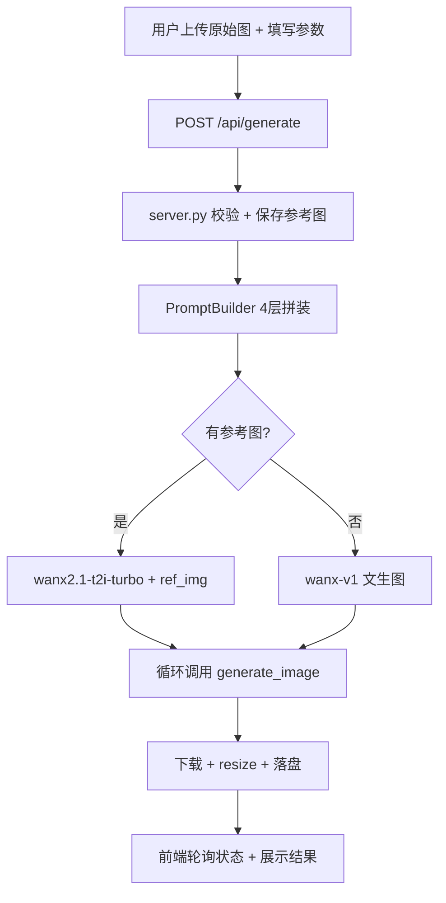

# Specification — 电商主图 & 详情图 AI 生成 Agent

> **项目名称**：E-Commerce Image Generator  
> **文档版本**：v1.0.0  
> **项目起始**：2026-08-07  
> **文档状态**：已实现  

---

## 目录

1. [项目概述](#1-项目概述)
2. [产品需求规格](#2-产品需求规格)
3. [技术架构设计](#3-技术架构设计)
4. [后端模块设计](#4-后端模块设计)
5. [前端架构设计](#5-前端架构设计)
6. [API 规范](#6-api-规范)
7. [数据模型](#7-数据模型)
8. [关键设计决策](#8-关键设计决策)
9. [非功能性需求](#9-非功能性需求)

---

## 1. 项目概述

### 1.1 背景

1688 电商平台的商家上架商品时，需要为每个 SKU 准备 **5 张主图（800×800）+ 10 张详情图（750×1000）**，共 15 张图片。传统方式需要摄影师拍摄 + 后期修图，成本高、周期长。

本项目通过 AI 图像生成模型（通义万相 / DALL·E 3 / Ollama 本地模型），让商家**上传一张商品原始图 + 填写商品参数**，一键批量生成 15 张电商场景图。

### 1.2 核心价值

| 价值点 | 说明 |
|--------|------|
| **降本增效** | 从摄影+修图数小时 → AI 生成数分钟 |
| **商品一致性** | 上传原始图作为参考，图生图保持商品外观 |
| **类型化配置** | 每个商品类目独立维护白名单和场景模板，杜绝编造参数 |
| **Prompt 工程化** | 4 层 Prompt 分层拼装，可维护、可复用 |
| **双模出图** | 云端 API（高质量）与本地 Ollama（零成本）自由切换 |

### 1.3 技术栈总览

| 层级 | 技术选型 | 选型理由 |
|------|----------|----------|
| 后端框架 | FastAPI + Pydantic v2 | 异步性能 + 严格类型校验 |
| 图像生成 | dashscope SDK / openai SDK / Ollama HTTP | 多模型统一接口 |
| 翻译服务 | Ollama gemma3 | 本地零成本中→英翻译 |
| 前端框架 | Vue 3.4 + TypeScript 5 | 组合式 API + 类型安全 |
| UI 组件库 | Element Plus 2.8 | 企业级组件 + 主题定制 |
| 状态管理 | Pinia 2 | 轻量、TS 友好、模块化 |
| 构建工具 | Vite 5 | 极速 HMR + ES Module |
| 打包下载 | JSZip + file-saver | 前端 ZIP 打包 |

---

## 2. 产品需求规格

### 2.1 用户角色

| 角色 | 描述 |
|------|------|
| **运营人员** | 在工作台选择类型、上传商品图、填写参数、生成图片 |
| **配置管理员** | 在配置中心管理商品类型、白名单、场景模板、System Prompt |

### 2.2 用户故事

#### US-1：上传商品原始图
> 作为运营人员，我希望上传一张商品原始图，让 AI 基于这张图生成所有场景图，保持商品外观一致。

**验收标准**：
- 主图模板区域第一个位置为上传卡片
- 支持点击上传 / 拖拽上传
- 上传后显示缩略图，hover 显示"重新上传"
- 生成时自动切换到支持图生图的模型（wanx2.1-t2i-turbo）
- 参考图通过 `ref_img` 参数传给 dashscope API

#### US-2：选择商品类型并填写参数
> 作为运营人员，我希望选择商品类型后，表单自动填充该类型的默认参数，且所有参数只能在白名单内选择。

**验收标准**：
- 未选类型时表单禁用 + 红色遮罩提示"请先选择类型"
- 选类型后自动填充默认值（标题/材质/规格/颜色/卖点）
- 所有字段为下拉选择，选项来自白名单，禁止手动输入
- 白名单为空时显示警告提示

#### US-3：勾选模板并批量生成
> 作为运营人员，我希望勾选要生成的模板，点击一键批量生成。

**验收标准**：
- 5 张主图 + 10 张详情图模板以卡片形式展示
- 点击卡片切换选中/取消选中
- 右上角勾选框实时反馈选中状态
- 底部显示选中数量 + "批量生成 N 张图"按钮
- 生成过程中按钮 loading + 实时日志 + 进度条

#### US-4：编辑场景 Prompt
> 作为配置管理员，我希望在生成前临时编辑某张图的场景 Prompt。

**验收标准**：
- 点击卡片上的编辑 icon 弹出编辑弹窗
- 弹窗显示中文场景 + 英文 Prompt
- 支持翻译按钮（Ollama gemma3 自动翻译）
- 三个操作按钮：重置（恢复后台默认）、同步到后台配置（持久化）、保存修改（仅本地）

#### US-5：配置中心管理类型
> 作为配置管理员，我希望在配置中心新增/编辑/删除商品类型，每个类型独立维护白名单和场景模板。

**验收标准**：
- 类型列表卡片展示，支持新增/编辑/删除/复制
- 每个类型 4 个 Tab：基础信息、主图场景（5张）、详情场景（10张）、System Prompt
- 白名单字段支持增删改
- 支持批量翻译（中文场景 → 英文 Prompt）
- 支持 JSON 导入/导出全量配置

#### US-6：Dry-Run 零成本验证
> 作为运营人员，我希望在不调用 API 的情况下验证 Prompt 拼装是否正确。

**验收标准**：
- Dry-Run 开关默认关闭
- 开启后点击生成，仅输出 Prompt + 占位图
- 日志中显示完整 Prompt（System + Product + Reference + Scene）

#### US-7：素材库管理
> 作为运营人员，我希望管理已生成的图片，支持删除恢复和打包下载。

**验收标准**：
- 生成结果画廊支持主图/详情/全部筛选
- 每张图支持预览、删除（标记删除可恢复）
- "全部打包 ZIP"一键下载
- 素材库 localStorage 持久化（上限 50 条）

### 2.3 功能需求清单

| 编号 | 模块 | 功能 | 优先级 |
|------|------|------|--------|
| F-01 | 图片生成 | 15 张模板批量生成 | P0 |
| F-02 | 图片生成 | 商品原始图上传 + 图生图 | P0 |
| F-03 | 图片生成 | 4 种模型切换（通义万相/DALL·E3/SDXL/Flux） | P0 |
| F-04 | 图片生成 | Dry-Run 占位图模式 | P1 |
| F-05 | Prompt | 4 层分层拼装（System/Product/Reference/Scene） | P0 |
| F-06 | Prompt | 场景 Prompt 在线编辑 | P1 |
| F-07 | Prompt | 同步到后台 / 重置默认 | P1 |
| F-08 | 配置中心 | 类型 CRUD + 复制 | P0 |
| F-09 | 配置中心 | 白名单管理（标题/材质/规格/颜色/卖点） | P0 |
| F-10 | 配置中心 | 场景模板管理（5主图 + 10详情） | P0 |
| F-11 | 配置中心 | 类目专属 System Prompt | P1 |
| F-12 | 配置中心 | JSON 导入/导出 | P1 |
| F-13 | 翻译 | 中→英自动翻译（Ollama gemma3） | P1 |
| F-14 | 翻译 | 单条翻译 + 批量翻译 | P1 |
| F-15 | 前端 | 左右分栏响应式布局 | P1 |
| F-16 | 前端 | 实时日志 + 进度条 | P1 |
| F-17 | 前端 | 素材库 + ZIP 打包下载 | P1 |
| F-18 | 前端 | API Key 在线配置 | P1 |

---

## 3. 技术架构设计

### 3.1 四层解耦架构

```
┌─────────────────────────────────────────────────────────────┐
│                        前端展示层                             │
│    Vue 3 + TypeScript + Element Plus + Pinia                │
│    HomePage（工作台） / AdminPage（配置中心） / ProductList  │
└──────────────────────────┬──────────────────────────────────┘
                           │ HTTP REST API
┌──────────────────────────┴──────────────────────────────────┐
│                      API 路由层 (server.py)                  │
│    FastAPI + Pydantic v2                                    │
│    请求校验 → 任务调度 → 轮询状态 → 结果返回                   │
└──────────────────────────┬──────────────────────────────────┘
                           │ 内部调用
┌──────────────────────────┴──────────────────────────────────┐
│                     业务逻辑层                                │
│    PromptBuilder    Translator    TypeConfigManager         │
│    (4层Prompt拼装)  (中→英翻译)   (类型配置CRUD)              │
└──────────────────────────┬──────────────────────────────────┘
                           │ 工厂分发
┌──────────────────────────┴──────────────────────────────────┐
│                      模型客户端层                             │
│    create_image_client() 工厂                                │
│    ┌─────────────┬─────────────┬──────────────┬───────────┐ │
│    │ TongyiWanx  │ Dalle3      │ OllamaSDXL   │ OllamaFlux│ │
│    │ (云端·图生图) │ (云端)      │ (本地)       │ (本地)    │ │
│    └─────────────┴─────────────┴──────────────┴───────────┘ │
└─────────────────────────────────────────────────────────────┘
```

### 3.2 设计模式

| 模式 | 应用场景 | 实现文件 |
|------|----------|----------|
| **工厂模式** | 按 `ImageModel` 枚举分发到具体模型客户端 | `image_client.py` `create_image_client()` |
| **策略模式** | 4 种模型客户端实现同一 `BaseImageClient` 抽象接口 | `image_client.py` |
| **模板方法** | `BaseImageClient.generate_image()` 定义统一接口，子类实现细节 | `image_client.py` |
| **建造者模式** | `PromptBuilder` 分步构建 4 层 Prompt | `prompt_builder.py` |
| **单例模式** | `TypeConfigManager` 线程安全单例管理类型配置 | `type_configs.py` |
| **观察者模式** | 前端 Pinia Store 响应式状态 + 轮询任务状态 | `generation.ts` |

### 3.3 数据流

#### 3.3.1 图片生成主流程

```
用户上传原始图（base64）
        │
前端 ProductForm
        │  POST /api/generate
        │  body: { type_id, model, only_keys, dry_run, product, original_image }
        ▼
后端 server.py (api_generate)
        │
        ├─→ 1. 校验类型存在 + 白名单参数
        ├─→ 2. 保存参考图到 output/_original_ref.png
        ├─→ 3. PromptBuilder 构建 15 条 Prompt
        │      [SYSTEM] + [PRODUCT] + [REFERENCE] + [SCENE]
        ├─→ 4. create_image_client(model, ref_img_url)
        │      └─ 有参考图 → wanx2.1-t2i-turbo + ref_img
        │      └─ 无参考图 → wanx-v1（文生图）
        ├─→ 5. 循环调用 client.generate_image()
        │      └─ 下载图片 → resize 到规范尺寸 → 落盘
        └─→ 6. 任务状态写入 TaskState（线程安全）
                │
前端轮询 GET /api/status/{task_id}
        │  实时日志 + 进度
        ▼
前端 GET /api/results/{task_id}
        │  图片列表 → 画廊渲染
        ▼
```

#### 3.3.2 类型配置流程

```
配置中心 AdminPage
        │
        ├─ 加载类型列表  GET /api/types
        ├─ 选中类型详情  GET /api/types/{id}
        ├─ 新增类型     POST /api/types
        ├─ 编辑类型     PUT /api/types/{id}
        ├─ 删除类型     DELETE /api/types/{id}
        ├─ 复制类型     POST /api/types/{id}/duplicate
        ├─ 导出全部     GET /api/types/export
        └─ 导入JSON     POST /api/types/import
                │
后端 TypeConfigManager
        │
        └─ type_configs.json（本地持久化）
```

---

## 4. 后端模块设计

### 4.1 config.py — 配置管理

#### 4.1.1 ImageModel 枚举

```python
class ImageModel(str, Enum):
    TONGYI_WANXIANG = "tongyi_wanxiang"   # 云端·通义万相
    DALLE3 = "dalle3"                      # 云端·DALL·E 3
    OLLAMA_SDXL = "ollama_sdxl"            # 本地·SDXL
    OLLAMA_FLUX = "ollama_flux"            # 本地·Flux
```

#### 4.1.2 ModelConfig 数据类

**关键设计**：`__post_init__` 每次实例化时从最新 `os.environ` 读取，解决 dataclass 字段默认值在类定义时固化的问题。

```python
@dataclass
class ModelConfig:
    DEFAULT_MODEL: ImageModel = ImageModel.OLLAMA_SDXL
    
    def __post_init__(self):
        load_dotenv(override=True)  # 强制重新加载 .env
        self.DASHSCOPE_API_KEY = os.getenv("DASHSCOPE_API_KEY", "").strip()
        self.OPENAI_API_KEY = os.getenv("OPENAI_API_KEY", "").strip()
        # ... 其他配置项
```

### 4.2 image_client.py — 图像客户端

#### 4.2.1 类继承结构

```
BaseImageClient (抽象基类)
    ├── TongyiWanxiangClient   # 通义万相（dashscope SDK）
    ├── Dalle3Client           # DALL·E 3（openai SDK）
    ├── OllamaSDXLClient       # Ollama SDXL（HTTP）
    └── OllamaFluxClient       # Ollama Flux（HTTP）
```

#### 4.2.2 统一接口

```python
class BaseImageClient(abc.ABC):
    def __init__(self, output_dir: str, ref_img_url: Optional[str] = None):
        self.output_dir = output_dir
        self.ref_img_url = ref_img_url  # 参考图 URL（图生图）
        self.cfg = ModelConfig()
    
    @abc.abstractmethod
    def generate_image(
        self, prompt: str, *,
        size_type: str,              # "main" | "detail"
        negative_prompt: Optional[str],
        file_stem: str,              # 如 "main_1"
    ) -> str:                        # 返回本地文件路径
        ...
```

#### 4.2.3 工厂函数

```python
def create_image_client(model_enum, output_dir, ref_img_url=None) -> BaseImageClient:
    mapping = {
        ImageModel.TONGYI_WANXIANG: TongyiWanxiangClient,
        ImageModel.DALLE3: Dalle3Client,
        ImageModel.OLLAMA_SDXL: OllamaSDXLClient,
        ImageModel.OLLAMA_FLUX: OllamaFluxClient,
    }
    return mapping[model_enum](output_dir, ref_img_url=ref_img_url)
```

#### 4.2.4 通义万相图生图逻辑

| 条件 | 模型 | ref_img 参数 |
|------|------|-------------|
| 有参考图 | `wanx2.1-t2i-turbo` | `ref_img=url, ref_strength=0.5` |
| 无参考图 | `wanx-v1` | 不传 |

尺寸映射：`800×800 → 1024*1024`，`750×1000 → 768*1152`（通义万相仅支持 4 种尺寸）

### 4.3 prompt_builder.py — Prompt 拼装引擎

#### 4.3.1 四层 Prompt 结构

```
[SYSTEM]    1688 B2B 电商摄影风格全局约束
            + 类目专属 System Prompt（如衣架类目特殊要求）
            
[PRODUCT]   Product category type: 衣架
            Product title: {白名单标题}
            Material: {白名单材质}
            Specification: {白名单规格}
            Main color: {白名单颜色}
            Key features: {白名单卖点}

[REFERENCE] Design based on the uploaded original product image.
            Keep the product appearance, shape, color and texture consistent.
            （仅当上传参考图时）

[SCENE]     {该场景的英文 Prompt，如 "White background studio shot"}
```

#### 4.3.2 核心方法

| 方法 | 职责 |
|------|------|
| `__init__(product, extra_negative, original_image)` | 加载类型配置、预构建公共变量块 |
| `_build_full_system_block()` | 拼接全局 System + 类目 System Extra |
| `_build_product_common_block()` | 从 `ProductInfo` 提取商品参数为公共变量 |
| `_build_single(scene)` | 拼装单张图的完整 Prompt（4 层合一） |
| `build_all()` | 批量构建 5 主图 + 10 详情图 Prompt |

### 4.4 translator.py — 翻译服务

| 特性 | 实现 |
|------|------|
| 模型 | Ollama gemma3（本地零成本） |
| 线程安全 | `threading.Lock()` |
| 内存缓存 | `{中文: 英文}` 字典，避免重复翻译 |
| 降级策略 | Ollama 不可用时返回空串，前端提示手动输入 |
| 批量翻译 | `translate_batch(texts: List[str])` 并发调用 |

### 4.5 type_configs.py — 类型配置管理

#### 4.5.1 数据结构

```python
@dataclass
class SceneConfig:
    key: str           # "main_1" / "detail_1"
    scene_cn: str      # "白底正面全景"
    scene_en: str      # "White background studio shot"

@dataclass
class TypeConfig:
    type_id: str                    # "hanger_default"
    type_name: str                  # "衣架"
    titles: List[str]               # 白名单标题
    materials: List[str]            # 白名单材质
    specs: List[str]                # 白名单规格
    colors: List[str]               # 白名单颜色
    features: List[str]             # 白名单卖点
    main_scenes: List[SceneConfig]  # 5 个主图场景
    detail_scenes: List[SceneConfig]# 10 个详情图场景
    system_extra_prompt: str        # 类目专属 System Prompt
    default_title: str              # 默认标题
    default_selected_features: List[str]  # 默认选中卖点
```

#### 4.5.2 TypeConfigManager

- **线程安全**：`threading.RLock()` 保护读写
- **持久化**：`type_configs.json` 本地文件
- **导入模式**：`merge`（合并） / `replace`（替换）

### 4.6 server.py — API 服务

#### 4.6.1 任务调度

```python
# 异步任务：后台线程执行生成，前端轮询状态
state = TaskState(task_id, ...)           # 线程安全状态对象
thread = threading.Thread(
    target=_run_generation_task,
    args=(state, product, extra_negative, original_image),
    daemon=True,
)
thread.start()
```

#### 4.6.2 TaskState 设计

| 字段 | 类型 | 说明 |
|------|------|------|
| `task_id` | `str` | 12 位 hex 唯一 ID |
| `status` | `TaskStatus` | `pending / running / done` |
| `total` | `int` | 本轮生成总数 |
| `done_count` | `int` | 成功数 |
| `failed_count` | `int` | 失败数 |
| `logs` | `List[LogEntry]` | 实时日志（带时间戳） |
| `generated` | `List[GeneratedImage]` | 生成结果 |

---

## 5. 前端架构设计

### 5.1 路由结构

| 路径 | 组件 | 说明 |
|------|------|------|
| `/` | `HomePage` | 工作台（参数表单 + 生成结果） |
| `/admin` | `AdminPage` | 配置中心（类型/白名单/场景管理） |
| `/products` | `ProductListPage` | 商品信息列表 |

### 5.2 Pinia Store 模块

#### 5.2.1 generation store（核心）

| 分类 | 成员 | 说明 |
|------|------|------|
| **state** | `configReady` | 配置是否初始化完成 |
| | `modelOptions` | 可用模型列表 |
| | `templates` | 15 张模板（含选中状态） |
| | `whitelist` | 当前类型的白名单 |
| | `product` | 商品参数（标题/材质/规格/颜色/卖点） |
| | `originalImage` | 商品原始图 base64 |
| | `dryRun` | Dry-Run 开关 |
| | `taskStatus` | 任务状态（pending/running/done） |
| | `logs` | 实时日志 |
| | `generated` | 生成结果列表 |
| **getters** | `selectedCount` | 选中模板数 |
| | `mainTemplates` / `detailTemplates` | 按组筛选模板 |
| | `progressPercent` | 进度百分比 |
| | `visibleGenerated` | 未删除的生成结果 |
| **actions** | `initConfig()` | 从 `/api/config` 初始化 |
| | `applyTypeToWorkbench(typeId)` | 应用类型到工作台 |
| | `startGeneration()` | 触发生成 + 轮询 |
| | `downloadAllZip()` | ZIP 打包下载 |

#### 5.2.2 types store

| 分类 | 成员 | 说明 |
|------|------|------|
| **state** | `slimList` | 类型简版列表 |
| | `currentTypeId` | 当前选中类型 ID |
| | `currentTypeDetail` | 当前类型完整详情 |
| **getters** | `selectorOptions` | 下拉选项格式 |
| | `hasSelected` | 是否已选类型 |
| **actions** | `loadList()` | 加载类型列表 |
| | `selectType(id)` | 选中类型 + 加载详情 |
| | `create/update/remove/duplicate` | 类型 CRUD |
| | `exportFile/importFile` | JSON 导入导出 |

#### 5.2.3 material store

| 分类 | 成员 | 说明 |
|------|------|------|
| **state** | `records` | 素材库记录（localStorage） |
| | `drawerVisible` | 抽屉可见性 |
| **actions** | `openDrawer/closeDrawer` | 抽屉控制 |
| | `addRecord/removeRecord` | 增删记录 |

### 5.3 组件设计

| 组件 | Props | Emits | 核心职责 |
|------|-------|-------|----------|
| `ProductForm` | — | `submit`, `before-generate` | 商品参数表单 + 模板选择 + 原始图上传 |
| `PromptPreview` | — | — | 实时日志展示 + 进度条 |
| `ImageCard` | `data: GeneratedImage` | `preview`, `delete`, `restore` | 单张图片卡片（预览/删除/恢复） |
| `MaterialDrawer` | `v-model` | — | 素材库抽屉 |
| `ModelConfigDialog` | `v-model` | — | 模型配置弹窗（API Key 输入） |
| `SceneTable` | `scenes`, `group` | `edit` | 场景表格（配置中心用） |

### 5.4 类型定义（关键）

```typescript
interface GenerateReqBody {
  type_id: string           // 必填：类型 ID
  model: string             // 模型枚举
  only_keys: string[]       // 空=全部，否则指定场景
  dry_run: boolean          // Dry-Run 模式
  extra_negative: string    // 自定义负面词
  product: ProductForm      // 商品参数
  original_image?: string   // 商品原始图 base64（图生图）
}

interface ImageTemplate {
  key: string               // "main_1"
  group: 'main' | 'detail'
  size: [number, number]    // [800, 800]
  scene_cn: string          // 中文场景
  scene_en: string          // 英文 Prompt
  selected: boolean         // 是否选中
}
```

---

## 6. API 规范

### 6.1 接口总览

| 方法 | 路径 | 说明 |
|------|------|------|
| GET | `/api/config` | 获取初始化配置 |
| POST | `/api/generate` | 启动生成任务 |
| GET | `/api/status/{task_id}` | 轮询任务状态 |
| GET | `/api/results/{task_id}` | 获取生成结果 |
| POST | `/api/translate` | 中→英翻译 |
| POST | `/api/config/api-keys` | 保存 API Key |
| GET | `/api/types` | 类型列表 |
| GET | `/api/types/{id}` | 类型详情 |
| POST | `/api/types` | 创建类型 |
| PUT | `/api/types/{id}` | 更新类型 |
| DELETE | `/api/types/{id}` | 删除类型 |
| POST | `/api/types/{id}/duplicate` | 复制类型 |
| GET | `/api/types/export` | 导出全部 |
| POST | `/api/types/import` | 导入 JSON |

### 6.2 核心接口详细

#### POST /api/generate

**请求体**：
```json
{
  "type_id": "hanger_default",
  "model": "tongyi_wanxiang",
  "only_keys": ["detail_1"],
  "dry_run": false,
  "extra_negative": "",
  "product": {
    "title": "衣架-ABS塑料成人款",
    "material": "ABS塑料",
    "spec": "成人款",
    "color": "白色",
    "features": ["防滑", "承重强"]
  },
  "original_image": "data:image/png;base64,iVBOR..."
}
```

**响应**：
```json
{
  "task_id": "340bd70ee624",
  "status": "pending"
}
```

#### GET /api/status/{task_id}

**响应**：
```json
{
  "task_id": "340bd70ee624",
  "status": "running",
  "total": 1,
  "done": 0,
  "failed": 0,
  "logs": [
    { "time": "00:18:11", "level": "INFO", "msg": "任务启动: type=衣架..." },
    { "time": "00:18:11", "level": "INFO", "msg": "参考图已保存..." }
  ]
}
```

---

## 7. 数据模型

### 7.1 后端核心数据结构

```
ProductInfo
├── type_id: str
├── title: str          ← 白名单校验
├── material: str       ← 白名单校验
├── spec: str           ← 白名单校验
├── color: str          ← 白名单校验
└── features: List[str] ← 白名单校验

TypeConfig
├── type_id / type_name
├── titles[] / materials[] / specs[] / colors[] / features[]  ← 白名单
├── main_scenes[5]   ← SceneConfig { key, scene_cn, scene_en }
├── detail_scenes[10] ← SceneConfig
├── system_extra_prompt
└── default_title / default_selected_features

BuiltPrompt
├── scene_key: str       # "main_1"
├── scene_cn: str        # 中文场景
├── positive: str        # 完整正向 Prompt（4层拼接）
└── negative: str        # 完整负面 Prompt
```

### 7.2 持久化

| 数据 | 存储方式 | 文件/位置 |
|------|----------|-----------|
| 类型配置 | JSON 文件 | `type_configs.json` |
| API Key | `.env` 文件 | `.env`（gitignore） |
| 生成图片 | 本地文件 | `output/*.png` |
| 参考图缓存 | 本地文件 | `output/_original_ref.png` |
| 素材库 | localStorage | 浏览器（上限 50 条） |
| 模型偏好 | localStorage | 浏览器 |

---

## 8. 关键设计决策

### 8.1 为什么 Prompt 用 4 层分层拼装？

**问题**：15 张图需要不同的场景描述，但商品参数、全局风格是共享的。

**决策**：将 Prompt 拆为 4 层：
- `[SYSTEM]` 全局约束（所有图共享）
- `[PRODUCT]` 商品参数（所有图共享）
- `[REFERENCE]` 参考图说明（有上传时共享）
- `[SCENE]` 单图场景（每张图不同）

**收益**：修改商品参数只需改一处，自动应用到所有图；场景 Prompt 独立维护互不影响。

### 8.2 为什么用工厂模式管理模型客户端？

**问题**：4 种模型的 SDK、参数、调用方式完全不同。

**决策**：`BaseImageClient` 抽象基类定义统一接口 `generate_image()`，4 个子类各自实现，工厂函数按枚举分发。

**收益**：新增模型只需加一个子类 + 工厂映射，业务代码零改动。

### 8.3 为什么 ModelConfig 用 `__post_init__` 而非字段默认值？

**问题**：Python dataclass 字段默认值在类定义时（模块导入时）求值，进程启动后修改 `os.environ` 不生效。

**决策**：字段默认值设为空常量，`__post_init__` 中每次实例化时 `load_dotenv(override=True)` + 从最新 `os.environ` 读取。

**收益**：前端在线保存 API Key 后，下一次生成任务立即生效，无需重启后端。

### 8.4 为什么白名单禁止手动输入？

**问题**：用户可能编造不存在的材质/规格，导致 Prompt 与实际商品不符。

**决策**：所有商品参数字段为 `el-select` 下拉，选项来自类型配置的白名单。白名单为空时禁用并提示去配置中心添加。

**收益**：保证 Prompt 中商品参数的准确性和一致性。

### 8.5 为什么图生图自动切换模型？

**问题**：`wanx-v1` 是纯文生图模型，不支持 `ref_img` 参数。

**决策**：检测到 `ref_img_url` 时自动切换到 `wanx2.1-t2i-turbo`（支持 `ref_img`），无参考图时回退到 `wanx-v1`。

**收益**：用户无需关心模型差异，上传参考图自动走图生图，不上传走文生图。

### 8.6 为什么用后台线程 + 轮询而非 WebSocket？

**问题**：图片生成是耗时操作（单张 10-60 秒），需要实时反馈进度。

**决策**：FastAPI 后台线程执行生成任务，前端 1.5 秒间隔轮询 `/api/status/{task_id}`。

**收益**：实现简单、无需额外依赖（WebSocket 需要额外库）、兼容性更好。

---

## 9. 非功能性需求

### 9.1 性能

| 指标 | 目标 |
|------|------|
| 单张图生成 | 云端 10-30s，本地 30-120s |
| 15 张图批量 | 云端 3-8 分钟，本地 8-30 分钟 |
| 前端首屏加载 | < 2s（Vite 构建 + CDN） |
| API 响应（非生成） | < 100ms |

### 9.2 安全性

| 措施 | 说明 |
|------|------|
| `.env` gitignore | API Key 永不提交 |
| 白名单校验 | 后端 `validate_product_params()` 二次校验 |
| 前端禁用 | 未选类型时表单禁用 + 遮罩 |
| 文件大小限制 | 原始图上传限 5MB |

### 9.3 可扩展性

| 扩展点 | 方式 |
|--------|------|
| 新增出图模型 | 继承 `BaseImageClient` + 工厂映射加一行 |
| 新增商品类型 | 配置中心 UI 操作，无需改代码 |
| 新增场景模板 | 配置中心编辑 `main_scenes` / `detail_scenes` |
| 新增白名单字段 | `TypeConfig` 加字段 + 前端表单加下拉 |

### 9.4 可维护性

| 措施 | 说明 |
|------|------|
| TypeScript 严格类型 | 前端全量类型定义，编译时捕获错误 |
| Pydantic v2 校验 | 后端请求/响应严格校验 |
| 四层解耦 | 配置/客户端/Prompt/路由 互不依赖 |
| SCSS 变量 | 全局设计 token（颜色/间距/圆角）统一管理 |

---

## 附录 A：项目目录结构

```
ecom-image-generator/
├── server.py              # FastAPI 后端服务
├── config.py              # 配置管理 + ModelConfig
├── image_client.py        # 图像客户端工厂（4 种模型）
├── prompt_builder.py      # 4 层 Prompt 拼装引擎
├── translator.py          # Ollama 中→英翻译
├── type_configs.py        # 类型配置管理器（单例 + 线程安全）
├── type_configs.json      # 类型配置数据
├── main.py                # CLI 入口
├── requirements.txt
├── .env.example
├── FLOW.mmd               # Mermaid 业务流程图
├── README.md
├── RELEASE_NOTES.md
├── SPEC.md                # 本文档
│
├── frontend/
│   ├── src/
│   │   ├── components/    # 6 个 Vue 组件
│   │   ├── views/         # 3 个页面
│   │   ├── store/         # 3 个 Pinia 模块
│   │   ├── api/           # 后端接口封装
│   │   ├── types/         # TypeScript 类型定义
│   │   ├── styles/        # 全局样式 + SCSS 变量
│   │   └── utils/         # 请求封装 + localStorage
│   ├── vite.config.ts
│   └── package.json
│
└── output/                # 生成图片输出目录
```

---

## 附录 B：Mermaid 架构图



---

*文档结束*
